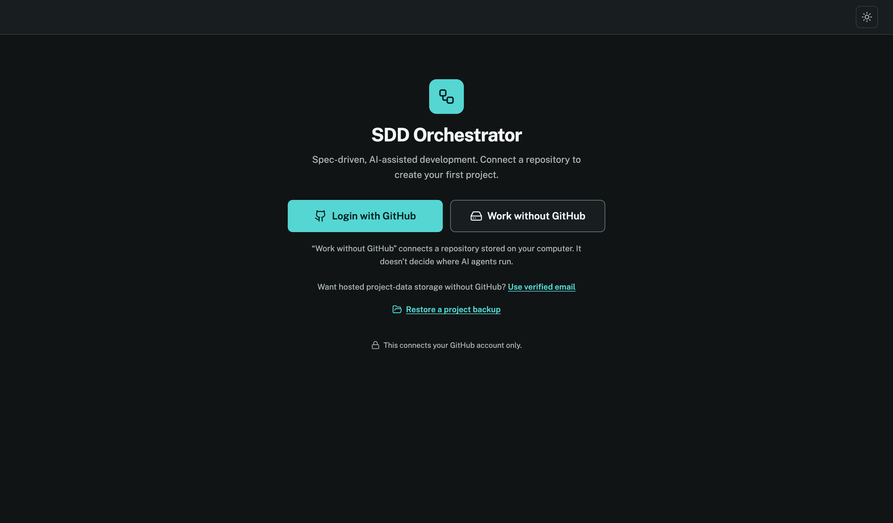
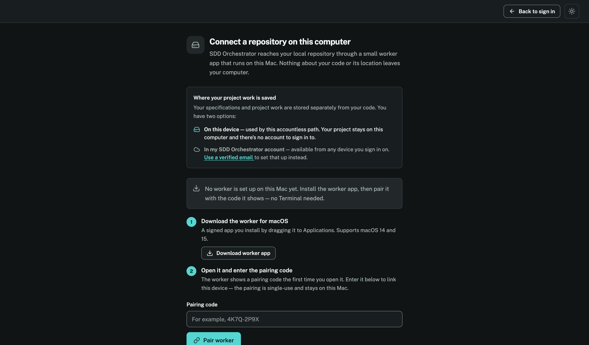

<div align="center">



# SDD Orchestrator

**A dashboard and control plane for spec-driven, AI-assisted software development.**

[](https://elixir-lang.org)
[](https://www.phoenixframework.org)
[](https://www.postgresql.org)
[](LICENSE)

</div>

---

## What this is

SDD Orchestrator turns a specification into working, verified code — with an AI coding agent doing the implementation and a human staying in control of every decision that matters.

You write what a feature should do. The product tells you what's missing before an agent ever touches code. Once a feature is ready, an authorized agent works on an isolated branch, runs tests, captures evidence, and either finishes or stops with a specific, answerable question. Nothing merges without passing its own proof.

It's built for **Spec-Driven Development (SDD)**: every feature lives as an approved specification (`requirements.md` → `design.md` → `tasks.md`) before a single line of implementation code is written, and every implementation slice ends in a verification gate that has to pass for real — not a rubber stamp.

This repository is itself the largest real product built with that workflow: **35 feature specifications**, most fully implemented and independently verified, delivered task-by-task by Claude Code and OpenAI Codex working from the same approved contracts. It's a live example of what the workflow produces, not just a description of it.

## Why it's different

- **The spec is the source of truth, not the chat log.** Requirements, design decisions, and task-level verification state live in version-controlled files under `specs/`, not in a conversation that evaporates when the context window fills up.
- **Agents stop, not guess.** When an agent hits a real product decision, it blocks, asks one focused question, and preserves its state — instead of inventing an answer and shipping it.
- **Local-first and accountless by default.** You can connect a repository straight from your computer through a paired local worker — no GitHub account, no uploading your source anywhere.
- **Privacy and data protection are a first-class requirement, not an afterthought.** Every schema, backend path, and retention/deletion process is designed against GDPR principles from the specification stage forward — data minimization, purpose limitation, and genuinely anonymous analytics are enforced in the approved contract, not bolted on later.
- **A read-only project assistant answers questions with receipts.** Ask it about your specs, board, or repository and it grounds every material claim in an exact citation — a specification revision, a repository line, a board item, a run — and says plainly when it doesn't know.

## Screenshots

<table>
<tr>
<td width="50%">

<p align="center"><em>Sign in with GitHub, or work entirely without an account</em></p>
</td>
<td width="50%">

<p align="center"><em>Accountless local onboarding — nothing about your code leaves your machine</em></p>
</td>
</tr>
</table>

## The core loop

1. A user creates a feature on a specification-focused board.
2. The product explains the required format and shows exactly what's missing before the feature can be handed to an agent.
3. Once requirements are sufficient, the user explicitly starts development.
4. An authorized AI coding agent works on an isolated branch, implements the feature, runs the project's real test suite, and captures evidence (test results, screenshots, when supported).
5. Progress and evidence attach directly to the feature's activity.
6. If the agent needs a product decision it can't make itself, it blocks, asks a focused question, and waits.
7. Once answered, the agent resumes and finishes verification.
8. When supported, the branch deploys to a preview environment and the user gets notified with a link and the result.

The full contract for this loop lives in [`specs/07-guided-specification-delivery/`](specs/07-guided-specification-delivery/).

## What's built

This isn't a prototype of the idea — most of the product surface is implemented and independently verified:

| Area | What it does |
|---|---|
| **Project onboarding** | GitHub-connected or fully local/accountless; hosted passwordless email access; identity linking |
| **Guided specification delivery** | The full board → readiness → agent execution → evidence → review loop |
| **Repository adoption** | Read-only assessment of an existing repository, an optional permanent SDD kit install, or bootstrapping a brand-new empty repository |
| **AI runtime governance** | Personal AI connections, model/quota policy, session pinning — no Orchestrator-funded fallback, ever |
| **Read-only project assistant** | Grounded Q&A over your specs, board, and repository with exact citations and visible uncertainty |
| **Local worker execution** | A paired local worker runs agents against your own filesystem, isolated per run |
| **Participation & collaboration** | Invite people to a project with a scoped, revocable role |
| **Privacy & data protection** | GDPR-aligned processing inventories, retention, deletion, and rights handling across every layer above |

Run `python3 .agents/scripts/slice_status.py` for the exact, current, per-specification status — it's a live report over the repository, not a snapshot that goes stale.

## How it's built: Spec-Driven Development

Every feature here goes through the same four operations, whether the implementer is Claude Code or OpenAI Codex:

- **`add-spec`** — define a feature's requirements, design, and task breakdown. No implementation.
- **`update-spec`** — change the agreement (scope, design, acceptance criteria) before touching code.
- **`implement-spec`** — implement and verify one approved slice against its own proof gate.
- **`review-spec`** — an independent agent re-runs a slice's proofs and reports findings without touching the code or the agreement itself, keeping implementer and reviewer separate.

Specifications are the actual contract, not documentation written after the fact:

```
specs/<feature>/
├── requirements.md   # what it must do, and why — acceptance criteria
├── design.md          # technical decisions and their tradeoffs
├── tasks.md            # the approved implementation slice + verification gate
└── progress.md        # dated, evidence-backed progress log
```

A task isn't done because an agent says so — it's done when its scoped proof passes, and a slice isn't `Verified` until its full gate (format, compile, lint, types, security scan, full test suite, browser matrix, production build) genuinely passes. Cross-specification dependencies are an explicit, validated capability graph (`python3 .agents/scripts/capability_index.py`), not an implicit ordering by file name.

Both Codex and Claude Code read the same shared contract (`AGENTS.md` / `CLAUDE.md`, kept byte-identical) and the same canonical skills under `.agents/skills/`.

## Tech stack

- **Backend:** Elixir, Phoenix, Phoenix LiveView, PostgreSQL (via Ecto), Cloak for field-level encryption
- **Frontend:** Server-rendered LiveView + Tailwind CSS, no separate SPA build
- **Coding agents:** OpenAI Codex as the primary agent, invoked through a versioned local worker protocol
- **Verification:** ExUnit, Playwright (desktop + mobile browser matrix), Credo, Dialyzer, Sobelow, `mix deps.audit`
- **Local-first storage:** an on-device store for accountless projects that never touches hosted persistence

## Getting started

```bash
# Toolchain (Elixir/Erlang/Node versions pinned in .mise.toml)
mise install

# Database
docker compose up -d postgres

# Dependencies, database setup, assets
mix setup

# Run it
mix phx.server
```

Visit `http://localhost:4000`. The local/accountless onboarding path works out of the box; GitHub-connected onboarding needs a GitHub App configured via environment variables (see `config/dev.exs`).

Before pushing changes:

```bash
mix check   # format, compile --warnings-as-errors, credo --strict, test
```

## Project structure

```
lib/sdd_orchestrator/       # domain contexts — one per bounded capability
lib/sdd_orchestrator_web/   # Phoenix web layer — LiveViews, components, controllers
specs/                      # the actual product contract — read this first
.agents/skills/             # canonical SDD workflow skills (add-spec, implement-spec, ...)
assets/e2e/                 # Playwright browser proof, one spec file per feature
priv/repo/migrations/       # database schema history
```

## Status

Actively developed as a real personal project — not a tutorial repo. The `specs/` directory is the honest, current source of truth for what's approved, what's implemented, what's verified, and what's still an open product question. This README describes direction and architecture; it is not itself an approved specification.

## License

This project is licensed under **[CC BY-NC-ND 4.0](LICENSE)** — you're welcome to read the code, fork it to run and experiment with locally, and learn from how it's built. Redistributing it, publishing a modified version, or using it commercially requires asking first. If you build on the ideas here, a credit back to this repository is appreciated.

## Acknowledgments

- [OpenAI Symphony](https://github.com/openai/symphony) — the implementation foundation this project started from for isolated agent workspaces, execution, and operational visibility.
- [Hermes Agent](https://github.com/NousResearch/hermes-agent) — a UX reference for clear provider authentication and model configuration.
